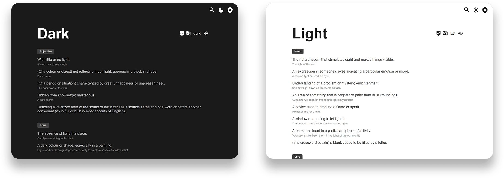

# New Word Tab
> A browser extension to learn a word per new tab!

## Installation
- [**Chrome Web Store**](https://chrome.google.com/webstore/detail/new-word-tab/chmiakanncpjleocgbemoghkkpjicjla)

- [**Firefox Add-ons**](https://addons.mozilla.org/en-US/firefox/addon/new-word-tab/)

## Description
Replace the new tab page with a new word definition and examples.
You can also listen to the word pronunciation. Switch between Light & Dark themes that best suit your desktop.

More features like *Words list management* & *Favorites sites shortcuts* will be added soon to give you more options on the new tab behavior.

## Contribution
You can find project roadmp [here](https://github.com/sajadhsm/new-word-tab/projects/1).

Feel free to suggest new ideas & report bugs. Pull requests are welcomed.